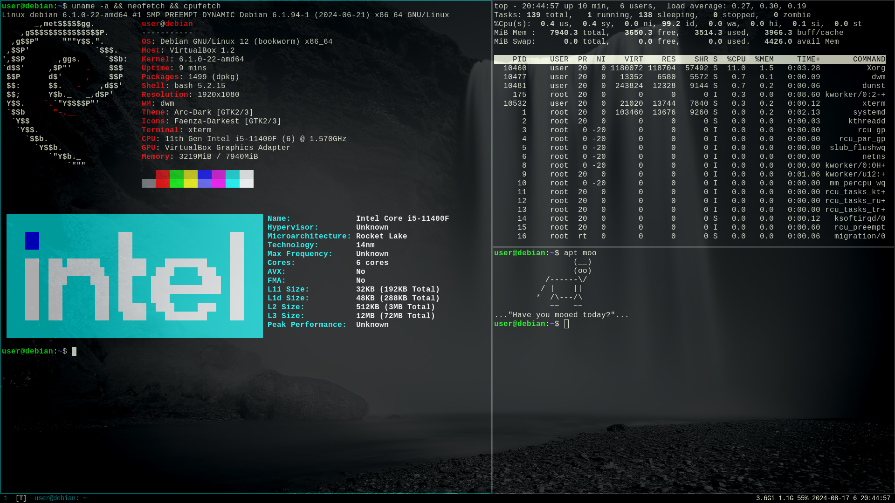

# .files

- some useful scripts in [`~/.local/bin/`](.local/bin)
  - [`dwmstatus`](.local/bin/dwmstatus.sh) - [status monitor](https://dwm.suckless.org/status_monitor) script for [dwm](https://dwm.suckless.org)
  - [`ffwebmenc`](.local/bin/ffwebmenc.sh) - script to encode videos in WebM VP9 using [ffmpeg](https://ffmpeg.org)
- some [`bash aliases`](.bashrc)
- configs for:
  - [`vim`](.vimrc)
  - [`emacs`](.emacs)
  - [`micro`](.config/micro/settings.json)
  - [`tmux`](.config/tmux/tmux.conf)
  - [`gtk2`](.config/gtk-2.0/gtkrc-2.0) & [`gtk3`](.config/gtk-3.0/settings.ini)
  - [`dunst`](.config/dunst/dunstrc)
  - [`dillo browser`](.dillo/dillorc)

# Yet Another Stupid Script

>[!WARNING]
>WORK IN PROGRESS

[`yass.sh`](yass.sh) - my own automated script to quickly deploy a comfy working environment for Debian (something like [LARBS](https://larbs.xyz/)). This script also automatically installs all the necessary software, packages, configs, scripts and dotfiles that I use.

## TODO:
- [ ] make the script work also in [Arch](https://archlinux.org)
- [ ] make configs more adapted for different distributions
- [ ] can install with debootstrap, pacstrap etc
- [ ] create and configure a new user
- [ ] make it little prettier
